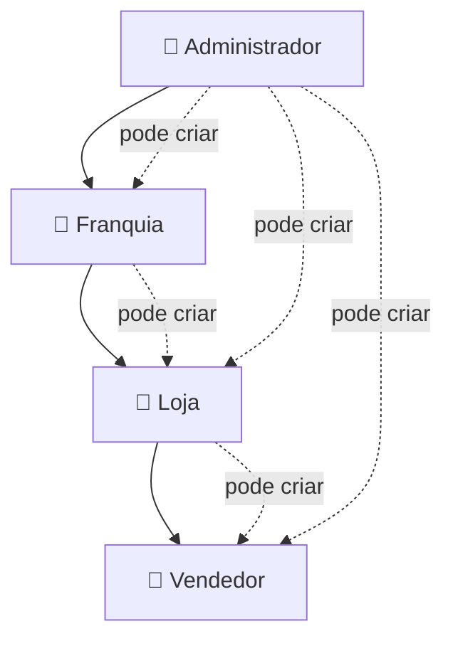

<!-- AI_CONTEXT: Este arquivo define a hierarquia de usuários e suas permissões. Consulte-o para entender QUEM pode fazer O QUÊ no sistema. -->

# 👥 Hierarquia de Usuários

> Definição de roles, permissões e regras de acesso do Conecta Obras.

---

## 🏛️ Estrutura Hierárquica



---

## 🎭 Roles do Sistema

### 1. Administrador (ADM)

> Dono do SaaS - acesso total ao sistema.

| Aspecto | Descrição |
|---------|-----------|
| **Quem é** | Equipe técnica/comercial do Conecta Obras |
| **Pode criar** | Franquias, Lojas, Vendedores |
| **Visibilidade** | Todo o sistema, todas as organizações |

#### Permissões Específicas

| Permissão | Acesso |
|-----------|--------|
| Visualizar dashboard global | ✅ |
| Cadastrar qualquer tipo de usuário | ✅ |
| Gerenciar APIs (Azulx, PH3) | ✅ |
| Visualizar logs de auditoria | ✅ |
| Distribuir créditos para Franquias | ✅ |
| Definir territórios (estados/cidades) | ✅ |
| Visualizar faturamento | ✅ |
| Acessar todos os CRMs | ✅ |

---

### 2. Franquia (FRQ)

> Organização que agrupa lojas - pode ser empresa ou pessoa responsável.

| Aspecto | Descrição |
|---------|-----------|
| **Quem é** | Empresa/pessoa que gerencia um grupo de lojas |
| **Pode criar** | Lojas |
| **Visibilidade** | Apenas suas lojas e vendedores |

#### Permissões Específicas

| Permissão | Acesso |
|-----------|--------|
| Visualizar dashboard da franquia | ✅ |
| Cadastrar lojas | ✅ |
| Distribuir territórios para lojas | ✅ (limitado ao que ADM liberou) |
| Distribuir créditos para lojas | ✅ (do seu saldo) |
| Visualizar relatórios de todas as lojas | ✅ |
| Gerenciar APIs | ❌ |
| Acessar CRM de vendedores | ✅ (somente leitura) |

#### Regra de Território

```
Franquia só pode distribuir para Lojas os territórios que o ADM liberou para ela.

Exemplo:
- ADM libera SP e RJ para Franquia X
- Franquia X pode dar SP para Loja A e RJ para Loja B
- Franquia X NÃO pode dar MG para nenhuma loja
```

---

### 3. Lojista (LOJ)

> Gerente de loja - administra vendedores.

| Aspecto | Descrição |
|---------|-----------|
| **Quem é** | Dono ou gerente de loja de materiais |
| **Pode criar** | Vendedores |
| **Visibilidade** | Apenas sua loja e seus vendedores |

#### Permissões Específicas

| Permissão | Acesso |
|-----------|--------|
| Visualizar dashboard da loja | ✅ |
| Cadastrar vendedores | ✅ |
| Distribuir territórios para vendedores | ✅ (limitado ao que Franquia liberou) |
| Visualizar CRM de todos os vendedores | ✅ |
| Visualizar relatórios de todos os vendedores | ✅ |
| Exportar indicadores | ✅ |
| Pesquisar leads (Obras/Empresas) | ✅ |
| Usar Consulta Plus | ✅ |

#### Regra de Território

```
Lojista pode dividir vendedores por cidade dentro do território da loja.

Exemplo:
- Loja tem acesso a todo SP
- Vendedor 1 → Campinas
- Vendedor 2 → São Paulo (capital)
- Vendedor 3 → Sorocaba
```

---

### 4. Vendedor (VEN)

> Usuário final - usa o sistema diariamente para prospecção.

| Aspecto | Descrição |
|---------|-----------|
| **Quem é** | Vendedor de loja de materiais de construção |
| **Pode criar** | Ninguém |
| **Visibilidade** | Apenas seus próprios leads |

#### Permissões Específicas

| Permissão | Acesso |
|-----------|--------|
| Pesquisar leads (Obras/Empresas) | ✅ (no seu território) |
| Usar Consulta Plus | ✅ |
| Adicionar leads ao CRM | ✅ |
| Visualizar CRM próprio | ✅ |
| Visualizar CRM de outros vendedores | ❌ |
| Ver indicadores próprios | ✅ |
| Ver indicadores da loja | ❌ |
| Exportar dados | ✅ (somente próprios) |

#### Regra de Privacidade

```
Vendedor só vê seus próprios leads no CRM.

Porém, ao pesquisar um novo lead:
- Se outro vendedor DA MESMA LOJA já está acompanhando → Alerta visual
- Informações exibidas: "Lead já em acompanhamento por [Nome] desde [Data]"
- Vendedor pode adicionar mesmo assim (a critério dele)
```

---

### 5. Convidado (GUEST)

> Usuário que se registrou externamente.

| Aspecto | Descrição |
|---------|-----------|
| **Quem é** | Pessoa que criou conta pelo registro público |
| **Pode criar** | Ninguém |
| **Visibilidade** | Limitada |

#### Permissões Específicas

| Permissão | Acesso |
|-----------|--------|
| Visualizar interface | ✅ |
| Pesquisar leads | ❌ (precisa comprar pacote) |
| Usar Consulta Plus | ❌ |
| Acessar CRM | ❌ |

> **Objetivo:** Permitir que interessados conheçam a plataforma antes de contratar.

---

## 🔐 Regras de Permissão

### Criação de Usuários

| Criador | Pode Criar |
|---------|------------|
| ADM | Franquia, Loja (vinculada a Franquia), Vendedor (vinculado a Loja) |
| Franquia | Loja |
| Loja | Vendedor |
| Vendedor | — |
| Convidado | — |

### Regra Obrigatória

> [!IMPORTANT]
> **Loja não pode existir sem Franquia.**  
> Se ADM criar uma Loja, deve obrigatoriamente vincular a uma Franquia existente.

### Distribuição de Créditos

```
ADM → Franquia → Loja → (consumo pelos vendedores)

Créditos são consumidos pelos vendedores ao usar:
- Consulta PH3
- Consulta Azulx/DUCs
- Consulta Deep Search (futuro)
```

---

## 📊 Matriz de Acesso por Módulo

| Módulo | ADM | Franquia | Lojista | Vendedor | Convidado |
|--------|-----|----------|---------|----------|-----------|
| Dashboard Global | ✅ | ❌ | ❌ | ❌ | ❌ |
| Dashboard Franquia | ✅ | ✅ | ❌ | ❌ | ❌ |
| Dashboard Loja | ✅ | ✅ | ✅ | ❌ | ❌ |
| Leads - Obras | ✅ | ✅ | ✅ | ✅ | ❌ |
| Leads - Empresas | ✅ | ✅ | ✅ | ✅ | ❌ |
| Consulta Plus | ✅ | ✅ | ✅ | ✅ | ❌ |
| Chat IA | ✅ | ✅ | ✅ | ✅ | ❌ |
| CRM - Próprio | ✅ | ✅ | ✅ | ✅ | ❌ |
| CRM - Equipe | ✅ | ✅ | ✅ | ❌ | ❌ |
| Relatórios Loja | ✅ | ✅ | ✅ | ❌ | ❌ |
| Indicadores Próprios | ✅ | ✅ | ✅ | ✅ | ❌ |
| Painel ADM | ✅ | ❌ | ❌ | ❌ | ❌ |
| Gestão de APIs | ✅ | ❌ | ❌ | ❌ | ❌ |
| Logs de Auditoria | ✅ | ❌ | ❌ | ❌ | ❌ |
| SDR (futuro) | ✅ | ✅ | ✅ | ❌ | ❌ |

---

## 🗃️ Modelo de Dados (Resumo)

```sql
-- Tabela de usuários
CREATE TABLE public.usuarios (
  id UUID PRIMARY KEY REFERENCES auth.users(id),
  email TEXT NOT NULL,
  nome TEXT NOT NULL,
  role TEXT NOT NULL, -- 'admin' | 'franquia' | 'lojista' | 'vendedor' | 'convidado'
  franquia_id UUID REFERENCES franquias(id),
  loja_id UUID REFERENCES lojas(id),
  territorios JSONB, -- ["SP", "RJ"] ou ["SP:Campinas", "SP:Sorocaba"]
  creditos_disponiveis INTEGER DEFAULT 0,
  created_at TIMESTAMPTZ DEFAULT now(),
  updated_at TIMESTAMPTZ DEFAULT now()
);

-- Hierarquia
-- Franquia: franquia_id = próprio ID, loja_id = NULL
-- Lojista: franquia_id = pai, loja_id = próprio ID
-- Vendedor: franquia_id = avô, loja_id = pai
```

---

<sub>Última atualização: 2026-01-12</sub>
