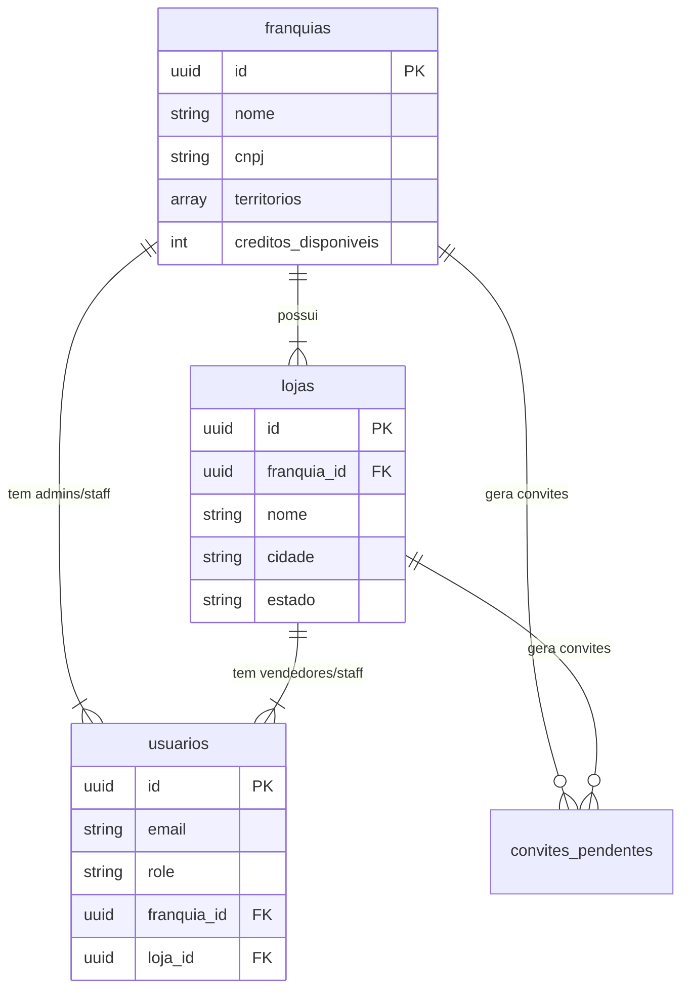
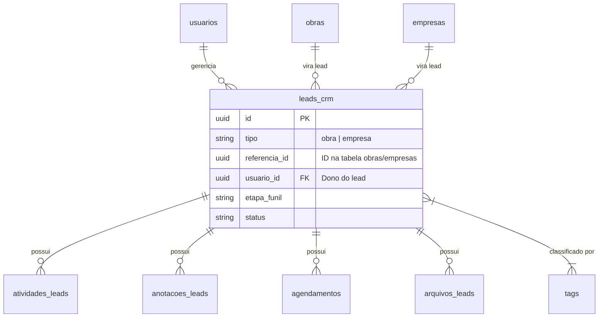

<!-- AI_CONTEXT: Este arquivo documenta o schema do banco de dados Supabase (PostgreSQL). Consulte-o para entender a estrutura de tabelas e relacionamentos. -->

# 🗄️ Database Schema

> Documentação técnica do banco de dados do Conecta Obras.

---

## 🗺️ Visão Geral (ER Diagram)

### Hierarquia de Usuários e Acesso

### CRM e Leads

---

## 🏛️ Tabelas Principais

### 1. Hierarquia e Autenticação

#### `franquias`
Entidade topo da hierarquia comercial. Possui saldo de créditos e territórios de atuação.
- **PK**: `id` (uuid)
- **Campos**: `nome`, `cnpj`, `responsavel_nome`, `responsavel_email`, `territorios` (array de strings), `creditos_disponiveis`, `ativa`.

#### `lojas`
Unidades de negócio vinculadas a uma franquia.
- **PK**: `id` (uuid)
- **FK**: `franquia_id` -> `franquias.id`
- **Campos**: `nome`, `cnpj`, `endereco`, `cidade`, `estado`, `territorios` (array), `creditos_disponiveis`, `ativa`.

#### `usuarios`
Extensão da tabela `auth.users` do Supabase. Define o perfil e permissões.
- **PK**: `id` (uuid) - Mesmo ID do Auth
- **FK**: `franquia_id` -> `franquias.id` (opcional)
- **FK**: `loja_id` -> `lojas.id` (opcional)
- **Campos**: `nome`, `email`, `role`, `telefone`, `avatar_url`, `territorios` (array), `ativo`.
- **Roles**: `'admin'`, `'franquia'`, `'lojista'`, `'vendedor'`, `'convidado'`.

#### `convites_pendentes`
Armazena convites enviados por email até que o usuário se registre.
- **PK**: `id` (uuid)
- **FK**: `franquia_id` ou `loja_id` (quem convidou/para onde)
- **Campos**: `email`, `role`, `token`, `expira_em`.

---

### 2. CRM (Customer Relationship Management)

#### `leads_crm`
Tabela central do CRM. Um lead é uma instância de prospecção sobre uma Obra ou Empresa.
- **PK**: `id` (uuid)
- **FK**: `usuario_id` (Vendedor dono), `loja_id` (Contexto da loja).
- **Referência Polimórfica**:
  - `tipo`: `'obra'` ou `'empresa'`
  - `referencia_id`: ID na tabela `obras` ou `empresas`.
- **Campos**: `etapa_funil`, `status` (ativo/perdido/ganho), `motivo_perda`, `valor_potencial`.

#### Detalhes do Lead
Tabelas satélites vinculadas ao `lead_id`:
- **`anotacoes_leads`**: Comentários e notas de texto.
- **`atividades_leads`**: Log de ações (mudança de etapa, ligação feita, etc).
- **`agendamentos`**: Tarefas e reuniões agendadas (`data_inicio`, `data_fim`).
- **`arquivos_leads`**: Anexos e documentos.
- **`leads_tags`** e **`tags`**: Sistema de etiquetas coloridas para organização.

#### WhatsApp
- **`conversas_whatsapp`**: Sessões de chat vinculadas a um Lead (`lead_id`).
- **`mensagens_whatsapp`**: Log de mensagens trocadas.

---

### 3. Fontes de Dados (Data Sources)

Tabelas "puras" contendo os dados dos produtos oferecidos pela plataforma.

#### `obras`
Dados de obras em andamento/projeto.
- **PK**: `id` (uuid)
- **Campos**: `titulo`, `descricao`, `endereco`, `cidade`, `estado`, `fase`, `padrao`, `area_total`, `valor_estimado`, `data_inicio`, `data_fim`.

#### `empresas`
Dados de construtoras, arquitetos, empreiteiras.
- **PK**: `id` (uuid)
- **Campos**: `razao_social`, `nome_fantasia`, `cnpj`, `endereco`, `contato_principal`, `telefone`, `email`.

#### `imoveis`
(Uso futuro/específico) Dados de imóveis.
- **Campos**: `endereco`, `tipo`, `area`, `valor_estimado`.

---

### 4. Logs e Consumo

#### `consultas_azulx` e `consultas_ph3`
Histórico de consultas realizadas nas APIs parceiras.
- **Campos**: `consultado_por` (usuario_id), `input_dados` (CPF/CNPJ buscado), `custo_creditos`, `status_consulta`.

#### `log_consumo_creditos`
Extrato de movimentação de créditos (débito por uso ou crédito por recarga).
- **Campos**: `franquia_id` ou `loja_id` ou `usuario_id` (origem), `quantidade`, `tipo_operacao` ('consumo', 'recarga', 'transferencia'), `descricao`.

---

## 🔒 Políticas de Segurança (RLS Overview)

O sistema utiliza Row Level Security (RLS) para garantir o isolamento:

1.  **Isolamento Vertical**:
    *   **Franquias** veem apenas suas Lojas e Vendedores.
    *   **Lojas** veem apenas seus Vendedores.
    *   **Vendedores** veem apenas seus próprios dados.

2.  **Isolamento de CRM**:
    *   Vendedores só acessam `leads_crm` onde `usuario_id = auth.uid()`.
    *   Gerentes (Lojistas) acessam todos `leads_crm` onde `loja_id = auth.user.loja_id`.

3.  **Dados Públicos vs Privados**:
    *   `obras`, `empresas` são "Leitura Pública" (para quem tem assinatura válida), mas **Escrita Restrita** (apenas Admin/Processos de Ingestão).

---

## 🧩 Enums e Tipos

### `role` (em `usuarios`)
*   `admin`
*   `franquia`
*   `lojista`
*   `vendedor`
*   `convidado`

### `status_lead` (conceitual em `leads_crm`)
*   `novo`
*   `em_andamento`
*   `ganho`
*   `perdido`
*   `congelado`

---
Gerado automaticamente via análise do Schema em 2026-01-12.
