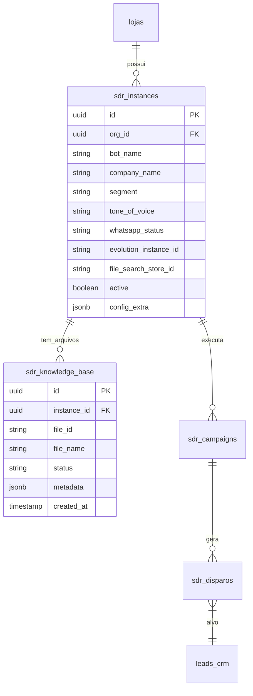

# 🏗️ SDR Module: Architecture & Database

> **Responsável:** Database Architect Agent
> **Status:** Draft

---

## 1. Diagrama de Entidade-Relacionamento (ERD Proposto)



---

## 2. Definição SQL (Supabase/PostgreSQL)

### 2.1 Tabela: `sdr_instances`
Armazena a configuração única do Bot por Organização.

```sql
CREATE TABLE public.sdr_instances (
    id UUID PRIMARY KEY DEFAULT gen_random_uuid(),
    org_id UUID NOT NULL REFERENCES public.lojas(id) ON DELETE CASCADE,
    
    -- Identidade do Bot
    bot_name TEXT NOT NULL DEFAULT 'Assistente',
    company_name TEXT,
    segment TEXT, -- Ex: 'Móveis Planejados', 'Energia Solar'
    tone_of_voice TEXT DEFAULT 'profissional_amigavel', -- 'formal', 'descontraido', etc.
    
    -- Integração WhatsApp (Evolution)
    evolution_instance_id TEXT, -- ID na Evolution API
    evolution_token TEXT, -- Token específico da instância (criptografar se possível)
    whatsapp_status TEXT DEFAULT 'disconnected', -- 'disconnected', 'connecting', 'connected'
    whatsapp_number TEXT,
    
    -- Integração RAG (Google)
    file_search_store_id TEXT, -- ID da Store no Google Vertex/FileSearch
    
    -- Meta
    active BOOLEAN DEFAULT false,
    created_at TIMESTAMPTZ DEFAULT now(),
    updated_at TIMESTAMPTZ DEFAULT now(),
    
    CONSTRAINT sdr_limit_one_per_org UNIQUE (org_id) -- 1 Instância por Org no MVP
);

-- RLS
ALTER TABLE public.sdr_instances ENABLE ROW LEVEL SECURITY;
```

### 2.2 Tabela: `sdr_knowledge_base`
Arquivos carregados para treinamento do RAG.

```sql
CREATE TABLE public.sdr_knowledge_base (
    id UUID PRIMARY KEY DEFAULT gen_random_uuid(),
    instance_id UUID NOT NULL REFERENCES public.sdr_instances(id) ON DELETE CASCADE,
    
    -- Google File Info
    google_file_id TEXT, -- ID retornado pela API do Google
    file_name TEXT NOT NULL,
    file_size_bytes BIGINT,
    mime_type TEXT,
    
    -- Processamento
    status TEXT DEFAULT 'uploading', -- 'uploading', 'indexing', 'ready', 'error'
    error_message TEXT,
    
    -- Metadata para filtro
    metadata JSONB DEFAULT '{}', -- Ex: { "categoria": "catalogo" }
    
    created_at TIMESTAMPTZ DEFAULT now()
);

-- RLS
ALTER TABLE public.sdr_knowledge_base ENABLE ROW LEVEL SECURITY;
```

### 2.3 Filas de Processamento (Conceitual)
Para escalar disparos, utilizaremos tabelas como filas (Pattern: Transactional Outbox) ou Supabase Queues se disponível (pg_net).
Por enquanto, estrutura de `sdr_disparos` funcionará como fila com status `pending`.

---

## 3. Fluxo de Dados

1.  **Onboarding:** Frontend → `sdr_instances` (Insert) → Edge Function (Cria Instância Evolution) → Retorna QR Code.
2.  **Upload:** Frontend → Storage → Edge Function (Envia p/ Google API) → `sdr_knowledge_base` (Update status).
3.  **Mensagem Recebida:** Webhook Evolution → Edge Function → Busca Contexto (RAG) → Gera Resposta (LLM) → Envia Mensagem (Evolution).
