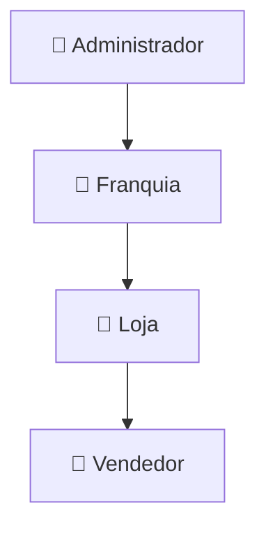

# 🔒 REGRAS DO PROJETO CONECTA OBRAS

> **⚠️ DOCUMENTO IMUTÁVEL**  
> Este arquivo contém as regras essenciais do projeto e NÃO deve ser modificado.  
> Consulte a documentação detalhada em `/docs` para mais informações.

---

## 📋 Índice

1. [Visão do Produto](#1-visão-do-produto)
2. [Tech Stack](#2-tech-stack)
3. [Convenções de Nomenclatura](#3-convenções-de-nomenclatura)
4. [Estrutura de Pastas](#4-estrutura-de-pastas)
5. [Mandamentos Invioláveis](#5-mandamentos-invioláveis)
6. [Hierarquia de Usuários](#6-hierarquia-de-usuários)
7. [Padrões de Componentes](#7-padrões-de-componentes)
8. [Comandos Úteis](#8-comandos-úteis)
9. [Documentação de Referência](#9-documentação-de-referência)

---

## 1. Visão do Produto

| Campo | Valor |
|-------|-------|
| **Produto** | Conecta Obras |
| **Descrição** | Plataforma de mapeamento de obras para geração de leads |
| **Segmento** | B2B - Construção Civil / Materiais de Construção |
| **Modelo** | SaaS com créditos de consulta |

### Módulos Principais

| Módulo | Descrição |
|--------|-----------|
| **Dashboard** | Panorama geral das obras |
| **Leads** | Pesquisa de Obras, Empresas, Imóveis |
| **CRM** | Gestão de relacionamento com leads |
| **Consulta Plus** | Busca livre por CNPJ/CPF |
| **Chat IA** | Assistente de IA para pesquisas |
| **Painel ADM** | Gestão de usuários e APIs |
| **SDR** | Prospecção automatizada (futuro) |

### APIs Externas

- **PH3**: Dados de pessoas físicas (nome, telefone, e-mail)
- **Azulx/DUCs**: Dados por CNPJ/CPF

---

## 2. Tech Stack

### Frontend

| Tecnologia | Versão | Propósito |
|------------|--------|-----------|
| Next.js | 16.0.10+ | Framework (App Router) |
| React | 19.2.0+ | UI Library |
| TypeScript | 5+ | Type Safety |
| Tailwind CSS | 4.1.9+ | Styling |
| shadcn/ui | latest | Componentes |
| Radix UI | latest | Primitivos acessíveis |
| Lucide React | latest | Ícones |
| TanStack Query | 5.x | Server state |
| Zustand | 5.x | Client state |
| React Hook Form | 7.x | Formulários |
| Zod | 3.x | Validação |

### Backend

| Tecnologia | Versão | Propósito |
|------------|--------|-----------|
| Supabase | latest | BaaS (Auth, DB, Storage, Edge Functions) |
| PostgreSQL | 15+ | Banco de dados |
| Deno | 2.x | Edge Functions |

### Infraestrutura

| Aspecto | Ferramenta |
|---------|------------|
| Frontend | Vercel |
| Backend | Supabase Cloud |
| CI/CD | GitHub Actions |

---

## 3. Convenções de Nomenclatura

> 📖 **Guia completo:** [21_convencoes_nomenclatura.md](./20_ARCH/21_convencoes_nomenclatura.md)

### Componentes (PascalCase)

| Tipo | Padrão | Exemplo |
|------|--------|---------|
| Páginas | `PaginaNome` | `PaginaListaObras` |
| Layouts | `LayoutNome` | `LayoutPrincipal` |
| Formulários | `FormularioNome` | `FormularioCadastroCliente` |
| Modais | `ModalNome` | `ModalConfirmacaoExclusao` |
| Tabelas | `TabelaNome` | `TabelaOrdensServico` |
| Cards | `CardNome` | `CardResumoObra` |
| Seletores | `SeletorNome` | `SeletorCentroCusto` |

### Hooks (camelCase com prefixo `use`)

| Tipo | Padrão | Exemplo |
|------|--------|---------|
| Data fetching | `useEntidade` | `useObras`, `useClientes` |
| Fetch único | `useEntidadePorId` | `useObraPorId` |
| Criar | `useCriarEntidade` | `useCriarObra` |
| Atualizar | `useAtualizarEntidade` | `useAtualizarObra` |
| Excluir | `useExcluirEntidade` | `useExcluirCliente` |

### Variáveis Booleanas (prefixos obrigatórios)

| Prefixo | Uso | Exemplo |
|---------|-----|---------|
| `esta` | Estado atual | `estaCarregando`, `estaAberto` |
| `tem` | Existência | `temErro`, `temDados` |
| `pode` | Permissão | `podeEditar`, `podeExcluir` |
| `deve` | Obrigação | `deveMostrarModal` |
| `foi` | Ação passada | `foiSalvo`, `foiEnviado` |

### Arquivos (kebab-case)

| Tipo | Formato | Exemplo |
|------|---------|---------|
| Componentes | kebab-case | `formulario-cliente.tsx` |
| Hooks | use-nome | `use-criar-obra.ts` |
| Types | tipos-nome | `tipos-cliente.ts` |
| Utils | descritivo | `formatadores.ts` |

### Banco de Dados (snake_case)

| Tipo | Formato | Exemplo |
|------|---------|---------|
| Tabelas | plural | `clientes`, `ordens_servico` |
| Colunas | snake_case | `nome_completo`, `data_criacao` |
| Foreign Keys | tabela_id | `cliente_id`, `obra_id` |
| Timestamps | padrão | `created_at`, `updated_at`, `deleted_at` |

---

## 4. Estrutura de Pastas

> 📖 **Guia completo:** [22_estrutura_projeto.md](./20_ARCH/22_estrutura_projeto.md)

```
src/
├── app/                    # App Router (páginas e rotas)
│   ├── (auth)/            # Páginas autenticadas
│   ├── (public)/          # Páginas públicas
│   └── api/               # API Routes
├── components/
│   ├── ui/                # shadcn/ui (CLI)
│   ├── compartilhados/    # Usados em 2+ features
│   └── layouts/           # Layouts reutilizáveis
├── features/              # Módulos por domínio
│   └── [feature]/
│       ├── components/
│       ├── hooks/
│       ├── types/
│       ├── utils/
│       └── index.ts       # Barrel export
├── hooks/                 # Hooks globais
├── lib/                   # Configs (supabase, utils)
├── types/                 # Types globais
└── utils/                 # Funções utilitárias

supabase/
├── migrations/            # SQL migrations
├── functions/             # Edge Functions
└── seed.sql               # Dados iniciais
```

### Onde Colocar

| Tipo | Local |
|------|-------|
| Componente específico | `features/[dominio]/components/` |
| Componente compartilhado | `components/compartilhados/` |
| Hook específico | `features/[dominio]/hooks/` |
| Hook genérico | `hooks/` |
| Feature NÃO importa de outra feature diretamente |

---

## 5. Mandamentos Invioláveis

### 🔴 Dados

| ❌ Nunca | ✅ Sempre |
|----------|----------|
| Deletar dados diretamente | Soft-delete (`deleted_at`) |
| Registro sem timestamps | `created_at` + `updated_at` |
| Consumir API sem log | Logs obrigatórios |
| Consulta API repetida | Salvar no cache |

### 🟡 UX

| ❌ Nunca | ✅ Sempre |
|----------|----------|
| Consumir API sem avisar | Mostrar créditos ANTES |
| Ação sem feedback | Feedback visual |
| Lead duplicado oculto | Alertar se em acompanhamento |
| Cards complexos | Cards simples e escaneáveis |
| Sem exportação | Excel + PDF obrigatório |

### 🟢 Negócio

| ❌ Nunca | ✅ Sempre |
|----------|----------|
| Loja sem Franquia | Hierarquia obrigatória |
| Vendedor vê CRM alheio | Só próprios leads |
| Território sem hierarquia | ADM → Franquia → Loja |

### 🔒 Segurança

| ❌ Nunca | ✅ Sempre |
|----------|----------|
| Tabela sem RLS | RLS em todas as tabelas |
| Confiar no client | Validar no backend |
| Secrets no código | Variáveis de ambiente |

---

## 6. Hierarquia de Usuários



### Roles

| Role | Descrição | Pode Criar |
|------|-----------|------------|
| **ADM** | Dono do SaaS | Franquia, Loja, Vendedor |
| **FRQ** | Grupo de lojas | Loja |
| **LOJ** | Gerente de loja | Vendedor |
| **VEN** | Usuário final | — |
| **GUEST** | Registro público | — |

### Visibilidade

| Role | Vê |
|------|-----|
| ADM | Tudo |
| Franquia | Suas lojas e vendedores |
| Lojista | Sua loja e vendedores |
| Vendedor | Apenas próprios leads |
| Convidado | Interface (sem função) |

### Distribuição de Créditos

```
ADM → Franquia → Loja → (consumo)
```

---

## 7. Padrões de Componentes

### Estrutura Base

```tsx
// formulario-cliente.tsx
'use client';

import { useState } from 'react';
import { useForm } from 'react-hook-form';
import { zodResolver } from '@hookform/resolvers/zod';

import { Button } from '@/components/ui/button';
import { useCriarCliente } from '@/features/clientes/hooks/use-criar-cliente';
import { schemaCliente, type DadosCliente } from '@/features/clientes/types/tipos-cliente';

interface FormularioClienteProps {
  aoSalvar?: (dados: DadosCliente) => void;
}

export function FormularioCliente({ aoSalvar }: FormularioClienteProps) {
  const [estaEnviando, setEstaEnviando] = useState(false);
  const { criarCliente } = useCriarCliente();
  
  const form = useForm<DadosCliente>({
    resolver: zodResolver(schemaCliente),
  });

  const aoSubmeter = async (dados: DadosCliente) => {
    setEstaEnviando(true);
    try {
      await criarCliente(dados);
      aoSalvar?.(dados);
    } finally {
      setEstaEnviando(false);
    }
  };

  return (
    <form onSubmit={form.handleSubmit(aoSubmeter)}>
      {/* campos */}
      <Button type="submit" disabled={estaEnviando}>
        {estaEnviando ? 'Salvando...' : 'Salvar'}
      </Button>
    </form>
  );
}
```

### Critérios de Aceitação

- ✅ Feedback visual para ações
- ✅ Tratamento de erros claro
- ✅ Loading state
- ✅ Responsivo mobile
- ✅ Log de auditoria
- ✅ Soft-delete

---

## 8. Comandos Úteis

### Desenvolvimento

```bash
pnpm dev              # Servidor de dev
pnpm build            # Build produção
pnpm start            # Inicia build
```

### Qualidade

```bash
pnpm lint             # Verifica linting
pnpm lint:fix         # Corrige linting
pnpm type-check       # TypeScript
pnpm test             # Testes
```

### Supabase

```bash
npx supabase start    # Inicia local
npx supabase stop     # Para local
npx supabase db push  # Migrations
npx supabase gen types typescript --local > src/types/supabase.ts
```

### Git (Conventional Commits)

```bash
feat(escopo): descrição    # Nova feature
fix(escopo): descrição     # Bug fix
docs(escopo): descrição    # Documentação
refactor(escopo): descrição
```

### Branches

| Branch | Propósito |
|--------|-----------|
| `main` | Produção estável |
| `develop` | Dev integrado |
| `feature/*` | Novas features |
| `fix/*` | Correções |
| `hotfix/*` | Urgências |

---

## 9. Documentação de Referência

### Leitura Obrigatória (novos devs)

1. [01_PROJECT_MEMORY.md](./01_PROJECT_MEMORY.md) — Contexto atual
2. [10_regras_globais.md](./10_PRODUCT/10_regras_globais.md) — Regras de negócio
3. [13_hierarquia_usuarios.md](./10_PRODUCT/13_hierarquia_usuarios.md) — Permissões
4. [21_convencoes_nomenclatura.md](./20_ARCH/21_convencoes_nomenclatura.md) — Nomenclatura
5. [22_estrutura_projeto.md](./20_ARCH/22_estrutura_projeto.md) — Estrutura
6. [DESIGN_SYSTEM.md](./DESIGN_SYSTEM.md) — Estilização

### Estrutura da Documentação

| Pasta | Conteúdo |
|-------|----------|
| `docs/` | Índice e visão geral |
| `docs/10_PRODUCT/` | Requisitos, PRDs, personas |
| `docs/20_ARCH/` | Arquitetura, ADRs, padrões |
| `docs/30_MODULES/` | Documentação por módulo |

### Templates

- **ADR:** [23_adr_template.md](./20_ARCH/23_adr_template.md)
- **Módulo:** [_TEMPLATE_MODULO.md](./30_MODULES/_TEMPLATE_MODULO.md)

---

> **⚠️ DOCUMENTO IMUTÁVEL — NÃO MODIFICAR**  
> <sub>Gerado em: 2026-01-12</sub>
